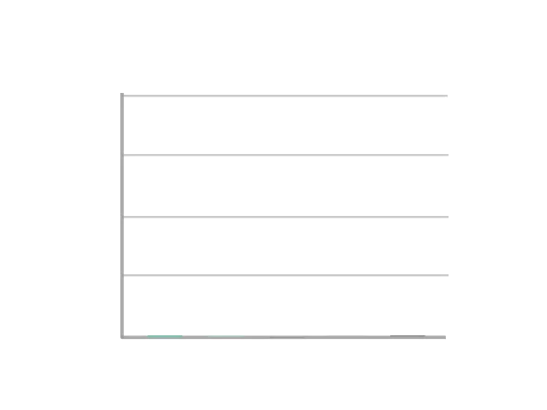

  ##  *Hi there* 

  <h4> My full name is Paulo Eduardo de Sordi Gomes </h4>

  I'm currently studying web development at [**Trybe**](https://www.betrybe.com/) 🚀️
  
Living in Brazil 🇧🇷️

  ## **Languages and Tools** 
  
            

  ## **Github Stats**  
  
  <h4 align="center">Visitor's count :eyes:</h4>
   
  
  
  
  

  ## **About me** 

* ⏲️ In my free time I love to play games, listen to music, watch videos, speak with my friends and stay with my family
* 🎶️ My favorite music style is Rock and Rap
* 🎮️ I just play FPS like CSGO, CoD and Valorant
* 💻️ Fascinated by technology and space 
* 🚀️ ₿itcoin enthusiast

  ## **Contact** 

     
  
  <a align="center" href="https://docs.google.com/document/u/5/d/e/2PACX-1vSLaUXyFWsvQ3zGTLSRjK-UXdPbzo9PWG1kLvFbhEuN3y6ifNrLNR-9sFwVis5EVRYZkaYnI8LTSOIe/pub">📃 Currículo 📃</a>

